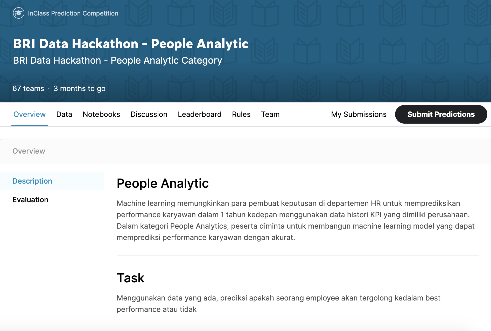

# BRI-Data-Hackathon
Created by: Indonesia AI Team

Our collaborative work for contributing to <a target="_blank" href="https://www.kaggle.com/c/bri-data-hackathon-people-analytic/overview">BRI Data Hackathon</a> Competition 2020.

Lastly, we achieved public score `0.53884` and got `4th` ranks on the competition. The following is several ideas we can try for future improvements:

1. Remove some features that decrease the amount of class `0`
2. Use appropriate metrics to evaluate models (e.g. Cross Validation)
3. Understand data deeper
